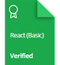

    

# HackerRank | Practice, Tutorials & Interview Preparation Solutions

This repository consists of solutions to HackerRank **practice**, **tutorials**, and **interview preparation** problems with **Python**, **mySQL**, **C#**, and **JavaScript**.

## Personal HackerRank Profile

[View Profile](https://www.hackerrank.com/ashishkumar_cse2)

## HackerRank Badges

## HackerRank Certificates

## Table Of Contents

* [Practices Completed](#practices-completed)
* [Tutorials Completed](#tutorials-completed)
* [Interview Preparation Kit](#interview-preparation-kit)
* [Certificates](#certificates)

## Practices Completed

* [Python](#python)
* [Regex](#regex)
* [Security](#security)
* [SQL](#sql)

 💻 This is my approach of solving the questions of 

<ul type="circle">
    <li><a style="color:red;" href="https://github.com/Ashish2030/Hackerrank/tree/main/30%20Days%20of%20Code(Hackerrank)"> 30 Days of Code on Hackerrank ✔️</a></li>
      <li><a href="https://github.com/Ashish2030/Hackerrank/tree/main/C%20(Hackerrank)"> C Language ✔️</a></li>
    <li><a href="https://github.com/Ashish2030/Hackerrank/tree/main/Java(Hackerrank)"> Java (Language Proficiency) ✔️</a></li>
    <li><a href="https://github.com//Ashish2030/Hackerrank/tree/main/java"> Problem Solving ✔️</a></li>
      <li><a href="https://github.com/Ashish2030/Hackerrank/tree/main/SQL(Hackerrank)"> SQL ✔️</a></li>
  </ul> 
  
  

  <strong> Hackerrank </strong>  : <a href="https://www.hackerrank.com/ashishkumar_cse2">https://www.hackerrank.com/ashishkumar_cse2</a> 
 
 <strong> Linkedin in </strong>  : <a href="https://www.linkedin.com/in/ashish-kumar-2030/">www.linkedin.com/in/ashish-kumar-2030 </a> 
 
 <strong> Github </strong>  : <a href="https://github.com/Ashish2030">https://github.com/Ashish2030</a>
  
   
  
